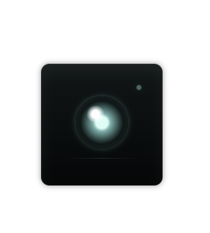

# Silent Monitor

Silent Monitor is a restrained machine eye designed to feel quiet, cold, and observant.

- Personality: discreet, suspicious, low-motion
- Unknown person: the status light turns aggressive and the eye becomes more severe
- Searching: the gaze intensifies without becoming dramatic
- No person: the whole PET feels dimmer and more withdrawn
- Overall feel: surveillance energy, minimal expression, controlled tension
